# Realtime Glass Shader
<video controls src="Recording/finalRaymarch.mp4" title="Title"></video>

#### Approach 1. Use Opaque 2D texture and sample
I first rendered the scene’s opaque objects into a texture. Then I rendered the transparent objects by sampling that opaque texture using the refracted direction. 
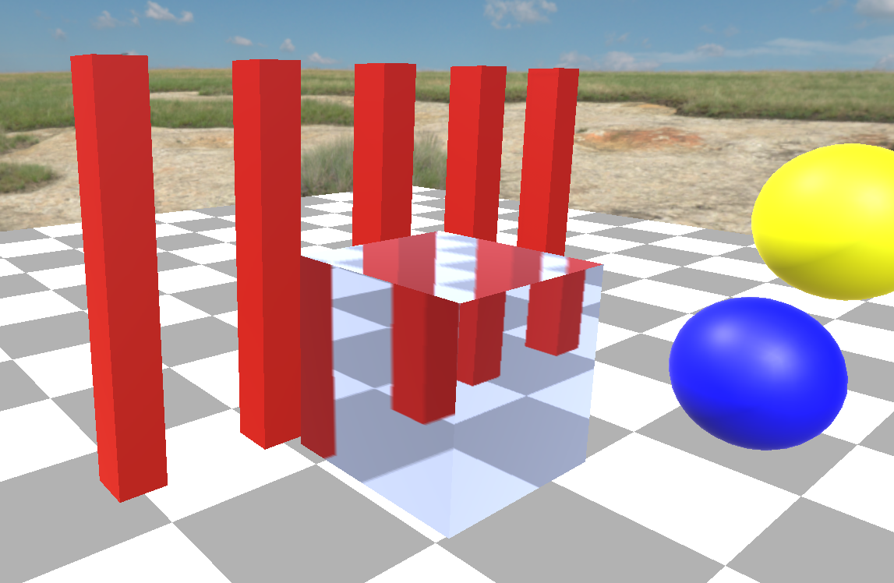

This is simple and efficient, but it has limitations. 
First, because the refracted ray is a 3D vector calculated using the view vector, the normal, and the ior, the opaque texture is 2D. 
Depth is not accounted for properly and the offset is not physically accurate. In some cases the offset does not look very convincing:
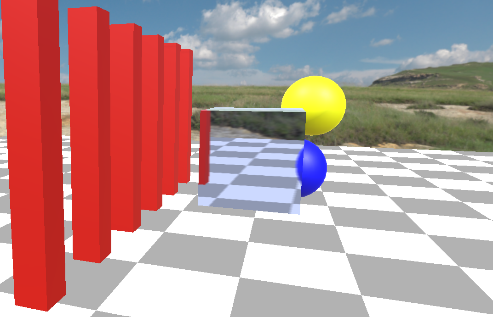

Another problem is reflection. To account for both reflection and refraction, we use the physically based BSDF for perfect glass:

F · reflection + (1 − F) · refraction, where F is the Fresnel reflectance term computed using Fresnel Schlick’s approximation.

Reflection is even harder to sample using the 2D opaque texture, because the reflected ray can point off-screen while the opaque texture only stores the current screen view. Because of this, many valid reflection directions have no corresponding data in the opaque texture.

Below is the same shader as above, but with Fresnel and reflection added. The reflection term is currently approximated with a single constant color.
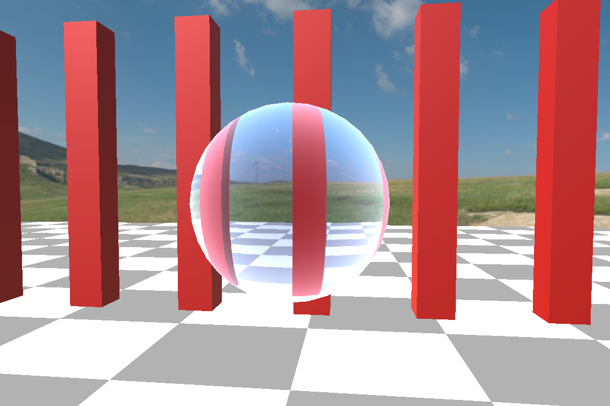
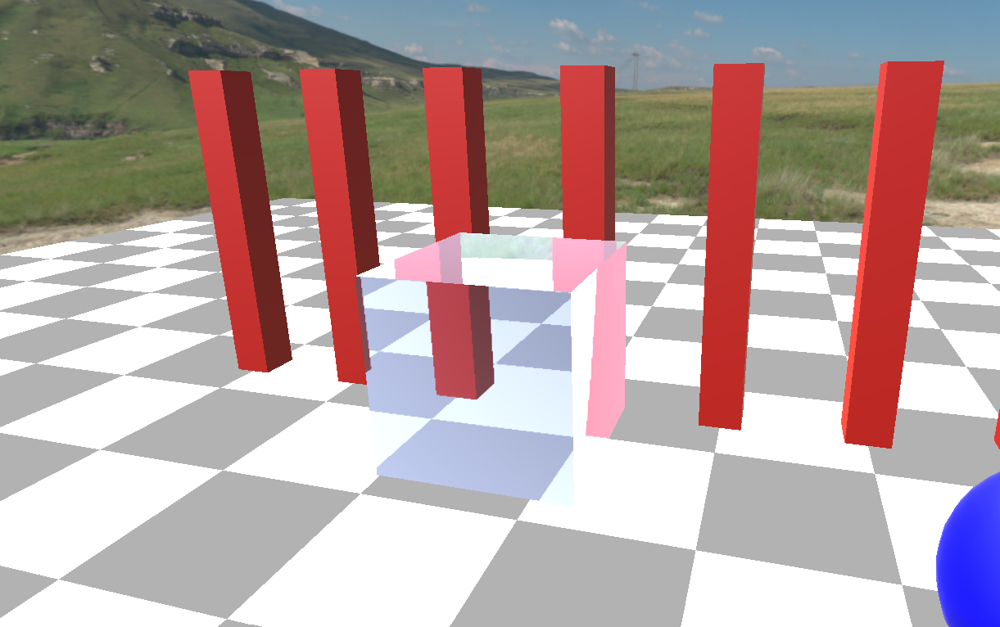

### Approach 2. Probe-based 
To get more accurate data for reflection and refraction, I switched to using a probe instead of the screen-space opaque texture. 
Specifically, I sample from a probe (essentially a 360° cubemap containing the scene and environment) captured at the world center. 

Probe visualization:
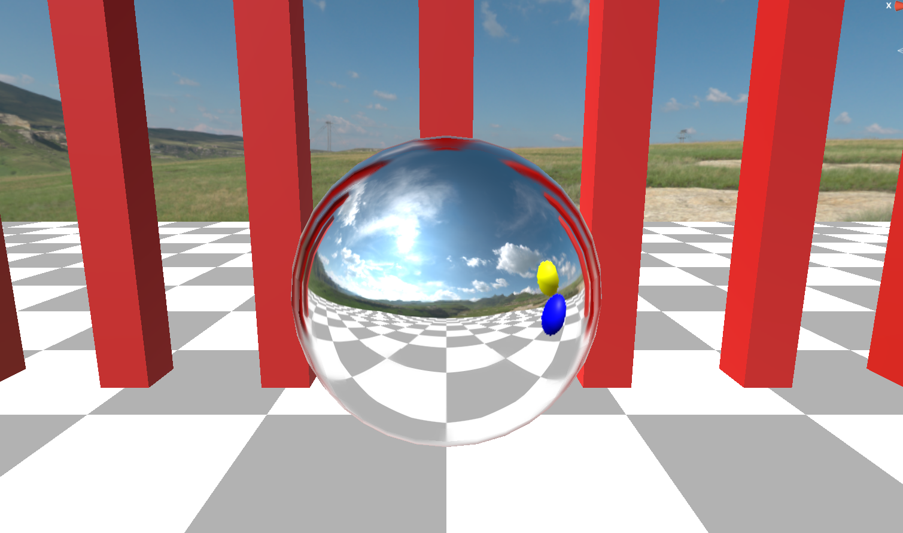

Updated glass shader, sampling probe for reflection and sampling the 2D opaque texture for refraction:
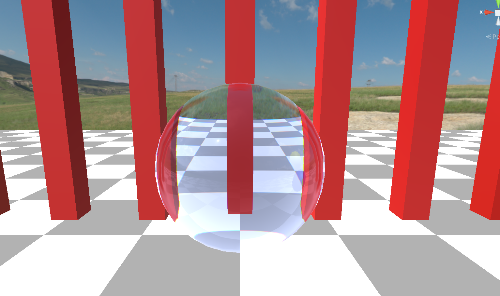
Zoomed in. We can now see actual reflections instead of a flat color!
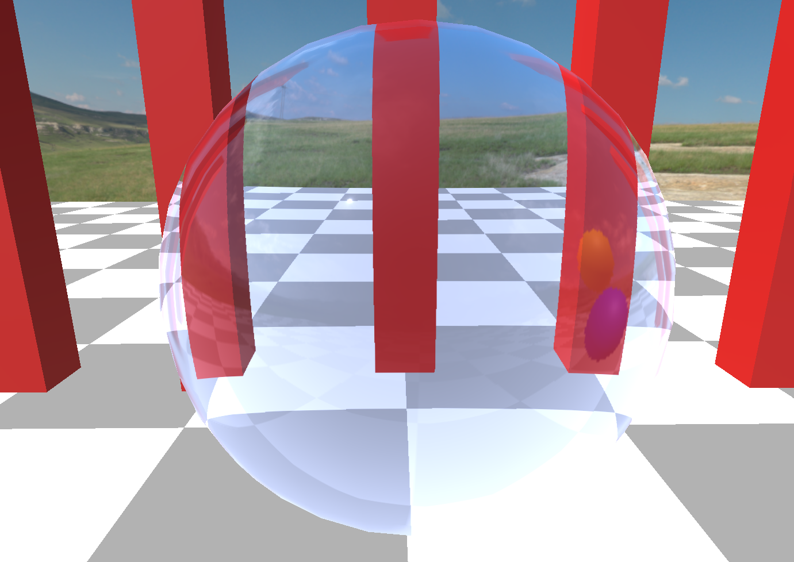

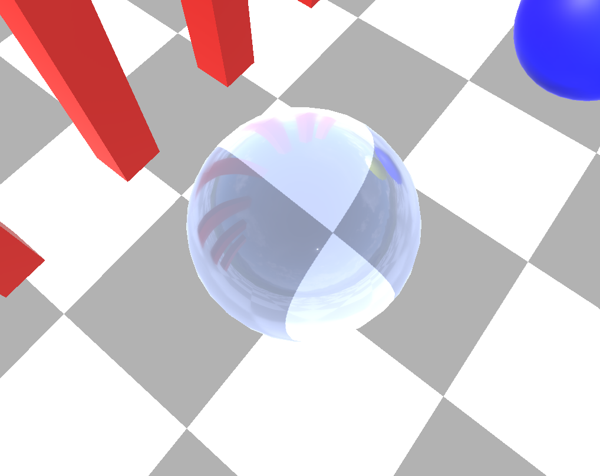

This is a cute glass surface shader, especially with some added blurry diffraction effect. 
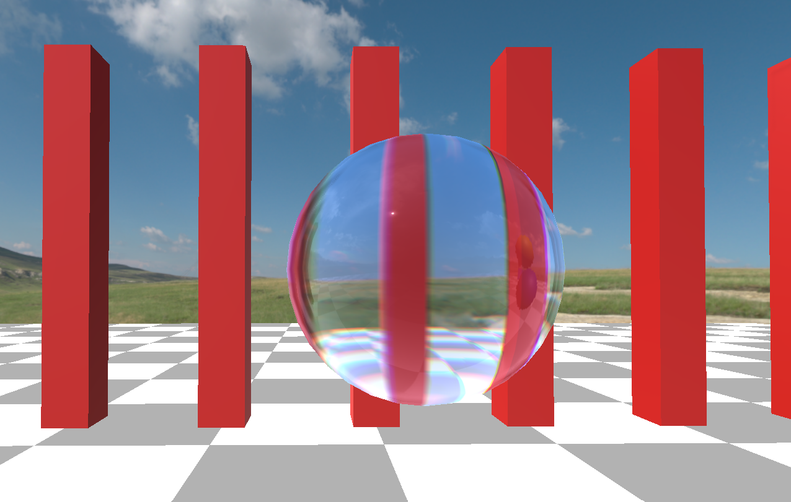

But there are still some limitations. 
For example, because we only sample one probe from the world center, the reflection looks the same regardless of where the glass object is. 
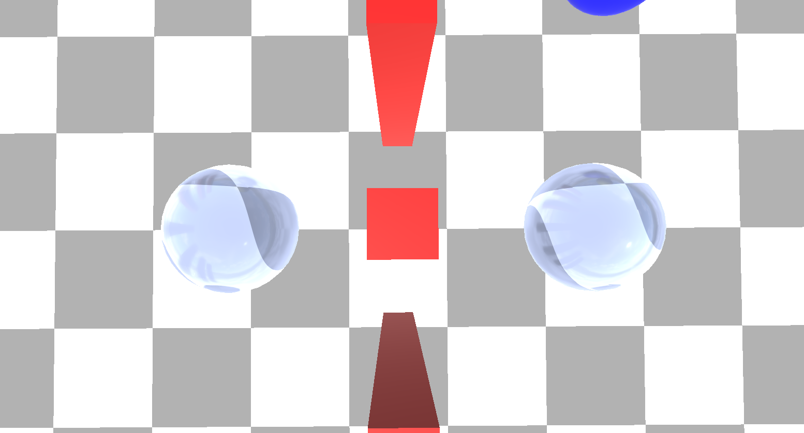
In the image above, the left sphere has the red bar reflection on its left side, but really it should be on the right. Even the right sphere's reflection is not quite right. The bars look rounded, almost like a fisheye lens.
This is the limitation of probes. It does not work well with nearby objects. 

We could use a probe per glass object, but that would be too expensive for real time, and nearby objects can still appear skewed. Also, whenever objects move in the scene, the probe has to be re-captured.
Another limitation is the lack of proper backface handling. When a ray enters the glass and refracts, it should refract again when exiting the surface, but this isn’t fully accounted for.

Both the 2D opaque texture approach and the reflection probe approach share the same core issue: they do not have **true geometry visibility**. In other words, when rays are refracted or reflected, we cannot physically accurately evaluate what they actually hit.

### SDF-Based Rendering

So I decided to take an SDF raymarching approach. Signed Distance Functions are great because they give true geometry visibility, meaning we can repeatedly bounce reflected and refracted rays and correctly evaluate what they intersect next.

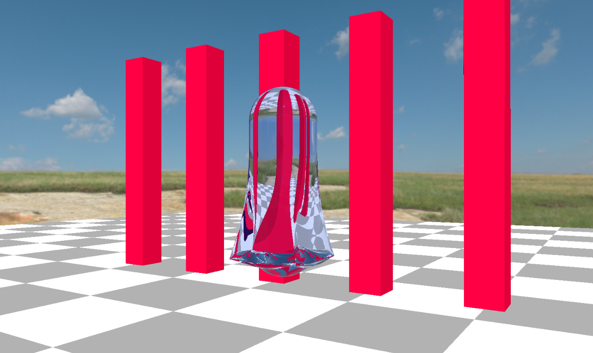

We now properly handle backfaces and get physically consistent refraction and reflection!

#### Notes on further improvements

**Rough glass:** The current model only supports physically based perfect glass. Supporting rough glass would be nice, but doing it physically accurately would likely require shooting many more rays, which would significantly increase runtime.

**Order-independent transparency:** Right now the raytraced model does not support multiple overlapping glass objects, and ignores additional glass intersections after the first glass object hit. More bounces would improve accuracy, but the difference might not be noticeable to a human eye. 

**Alternatives to SDF-based raymarching:** Using a Bounding Volume Hierarchy instead of SDFs would allow us to import and raytrace arbitrary 3D models in the scene. 
Rendering a backface depth buffer
Instead of raymarching, I saw an approach with a backface depth buffer being used in surface shaders. It uses the backface texture to approximate the thickness of the object, which is helpful for refracting in and out the object.

### Resources
